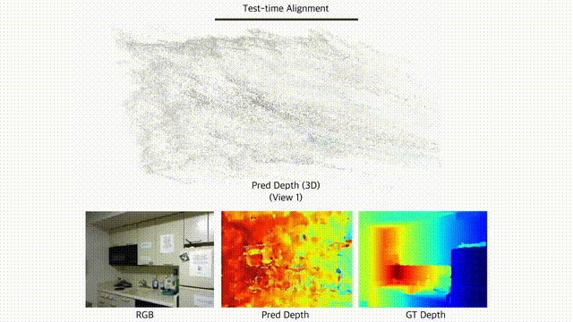

# Zero-shot Depth Completion via Test-time Alignment with Affine-invariant Depth Prior (AAAI 2025)
<!-- Authors: [Lee Hyoseok](https://hyoseok1223.github.io/), [Kyeong Seon Kim](https://www.linkedin.com/in/ks-kim/), [Kwon Byung-Ki](https://sites.google.com/view/kwon-byung--ki/%ED%99%88), [Tae-Hyun Oh](https://ami.postech.ac.kr/members/tae-hyun-oh) -->

## [Project Page](https://hyoseok1223.github.io/zero-shot-depth-completion/) | Paper | arXiv | Video

This repository contains a pytorch implementation of the AAAI 2025 paper, "[Zero-shot Depth Completion via Test-time Alignment with Affine-invariant Depth Prior](https://hyoseok1223.github.io/zero-shot-depth-completion/)". Our zero-shot depth completion method, which aligns sparse depth measurements with affine-invariant depth diffusion model at test-time, demonstrates impressive performance across various domains.



## Setup
This code was tested on Ubuntu 18.04 with Python 3.11, CUDA 12.1 and PyTorch 2.5.1.

1. Clone this repository
```
https://github.com/postech-ami/Zero-Shot-Depth-Completion.git
```

2. Install the requirements with pip
```
pip insall -r requirements.txt
```

3. Model checkpoint
For [Marigold](https://marigoldmonodepth.github.io/), you can easily use the Hugging Face Hub, as it is already integrated into this repository. For DepthFM, you need to download the weights by following the instructions on the [DepthFM Github](https://github.com/CompVis/depth-fm)

## Run
We provide two depth diffusion models, [Marigold](https://marigoldmonodepth.github.io/) and [DepthFM](https://depthfm.github.io/), for zero-shot depth completion. Each model comes with its own dedicated script.

```
# Marigold base
sh scripts/run_opt_marigold.sh  

# DepthFM base
sh scripts/run_opt_depthfm.sh  
```

Each script consists of two steps:
1. Generating structure-guided relative depth.
2. Performing test-time alignment with sparse depth measurements.
```
# Get Marigold's initial affine-invariant, sharp structure depth guidance
python run_marigold.py --input_root_dir "$INPUT_DIR"

# Run the test-time alignment with sparse depth
python run_opt_marigold.py --input_root_dir "$INPUT_DIR" --r_ssim_depth
```

We recommend checking the arguments of each Python script for controllability.


## Citation
```
@inproceedings{
hyoseok2024zeroshot,
title={Zero-shot Depth Completion via Test-time Alignment with Affine-invariant Depth Prior},
author={Lee Hyoseok and Kyeong Seon Kim and Kwon Byung-Ki and Tae-Hyun Oh},
booktitle={The 39th Annual AAAI Conference on Artificial Intelligence},
year={2025},
}
```

## Contact
Lee Hyoseok (hyos99@postech.ac.kr)  
Kyeong Seon Kim (ella94.ai@gmail.com)

## Acknowledgement
We thank the members of [AMILab](https://ami.postech.ac.kr/members) for their helpful discussions and proofreading.

Our implementation is based on and adapted from seminal projects. We sincerely appreciate the authors for their excellent work and for sharing their code publicly.

- [Marigold](https://github.com/prs-eth/Marigold)
- [DepthFM](https://github.com/CompVis/depth-fm)
- [Resample](https://github.com/soominkwon/resample)
- [VOICED](https://github.com/alexklwong/unsupervised-depth-completion-visual-inertial-odometry)

## Data Examples

This repository includes a small subset (2-3 samples) of the KITTI Depth Completion dataset for demonstration purposes. Full dataset can be accessed at [KITTI Depth Completion Benchmark](https://www.cvlibs.net/datasets/kitti/eval_depth.php?benchmark=depth_completion).

**KITTI Dataset License:**  
The KITTI dataset is copyrighted by the Karlsruhe Institute of Technology and Toyota Technological Institute at Chicago. It is provided for non-commercial research and educational purposes only.


## TODO
- [ ] Add inference and evaluation code for [VOID](https://github.com/alexklwong/void-dataset) and [KITTI-DC](https://www.cvlibs.net/datasets/kitti/eval_depth.php?benchmark=depth_completion) datasets.
- [ ] Provide additional details for performance improvement (e.g., using 2x downsampled inference size enhances performance on the VOID dataset).
